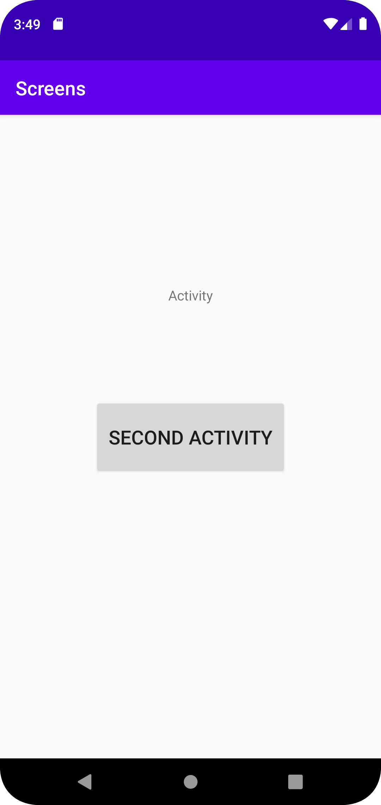
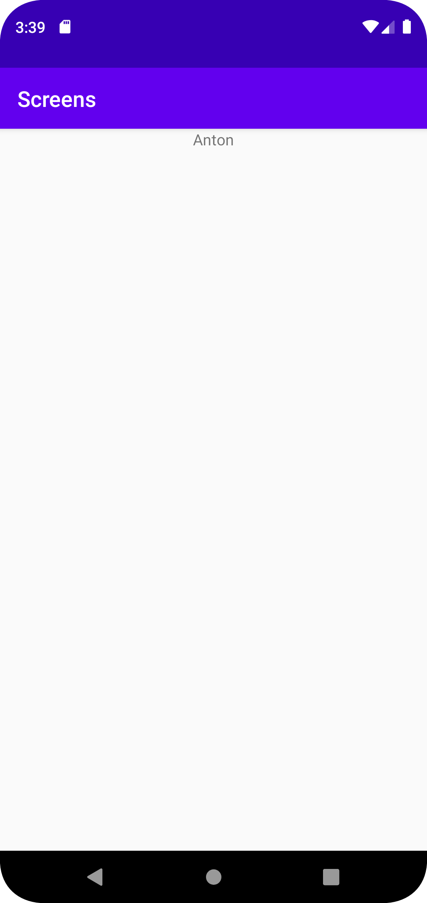

# Rapport

Skapade en second activity som använder data för vad som skrivs ut i denna activity. Datan hämtas från första aktiviteten.

activity_main som skapar första sidan och tar med data och startar andra aktivitetn på knapptryck.
```java
public class MainActivity extends AppCompatActivity {
Button activityButton;
@Override
protected void onCreate(Bundle savedInstanceState) {
super.onCreate(savedInstanceState);
setContentView(R.layout.activity_main);
activityButton = findViewById(R.id.activityButton);
activityButton.setOnClickListener(new View.OnClickListener() {
@Override
public void onClick(View view) {
Intent intent = new Intent(MainActivity.this, SecondActivity.class);
intent.putExtra("name", "Anton");
startActivity(intent);

            }
        });

    }

}
```

Second activitys kod, hämtar name från intents i activity_main.
```java
public class SecondActivity extends AppCompatActivity {
    TextView secondTextView;
    protected void onCreate(Bundle savedInstanceState) {
        super.onCreate(savedInstanceState);
        setContentView(R.layout.second_activity);
        Bundle extras = getIntent().getExtras();
        secondTextView = findViewById(R.id.secondTextView);
        if (extras != null) {
            String name = extras.getString("name");
            secondTextView.setText(name);
            // Do something with the name and number
        }

    }
}
```

Knappen i activity_main.xml, där knappens dimensioner och text på knappen är utskriven.
```xml
<Button
android:layout_width="200dp"
android:layout_height="80dp"
android:text="Second activity"
android:textSize="20dp"
android:id="@+id/activityButton"
app:layout_constraintBottom_toBottomOf="parent"
app:layout_constraintLeft_toLeftOf="parent"
app:layout_constraintRight_toRightOf="parent"
app:layout_constraintTop_toTopOf="parent"
/>
```

Skärmdump för uppstart.


Skärmdump för andra aktiviteten.

